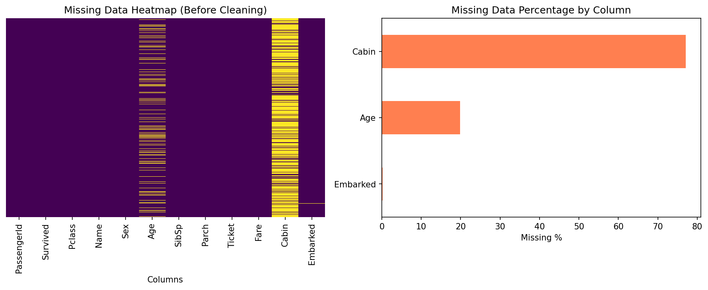
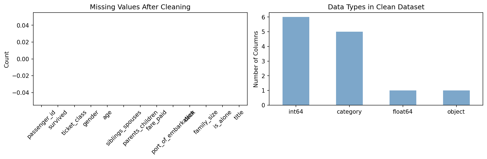

# Task 1 — Data Cleaning & Preprocessing
**Synent Technologies Data Science Internship**
**Candidate:** Sil Shah | **Level:** Basic

---

## Problem Statement
Raw Titanic dataset contains missing values (Age: 19.9%, Cabin: 77.1%,
Embarked: 0.2%), inconsistent data types, and no meaningful derived features.
Goal: produce a fully clean dataset ready for EDA and modeling.

---

## Dataset
- **Name:** Titanic Dataset
- **Source:** [datasciencedojo/datasets](https://github.com/datasciencedojo/datasets/blob/master/titanic.csv)
- **Size:** 891 rows × 12 columns

---

## Approach

| Column   | Missing % | Strategy                           |
|----------|-----------|------------------------------------|
| Age      | 19.9%     | Median imputation grouped by Pclass|
| Cabin    | 77.1%     | Extracted Deck letter, then dropped|
| Embarked | 0.2%      | Filled with mode (S)               |
| Fare     | 0%        | No action needed                   |

---

## Feature Engineering (Bonus)
| Feature      | Description                        |
|--------------|------------------------------------|
| FamilySize   | SibSp + Parch + 1                  |
| IsAlone      | 1 if travelling alone, else 0      |
| Title        | Extracted from Name (Mr, Mrs, etc) |
| Deck         | First letter of Cabin              |

---

## Results
- ✅ 0 missing values in final dataset
- ✅ 15 clean, properly typed columns
- ✅ 3 bonus engineered features added
- ✅ All columns renamed to snake_case

---

## Visualizations

---

## Tools Used
Python · Pandas · NumPy · Matplotlib · Seaborn · Google Colab

---

## Files
| File | Description |
|------|-------------|
| `Task1_DataCleaning_TitanicDataset.ipynb` | Main notebook |
| `titanic_cleaned.csv` | Final clean dataset |
| `missing_data_before.png` | Missing data heatmap |
| `cleaning_summary.png` | Before/after summary chart |
